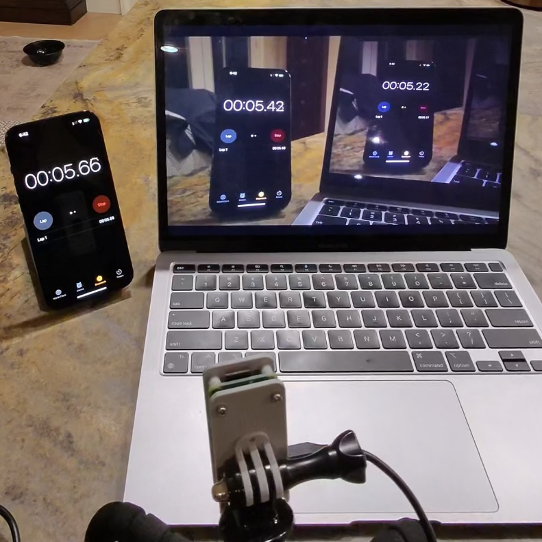

# TCP Camera Stream for Raspberry Pi 

The video stream here is easy to implement and came in at about 240ms of latency. This repository is one in several aimed at testing the different options for [streaming video from a raspberry pi](https://www.raspberrypi.com/documentation/computers/camera_software.html#tcp) with raspberry pi camera module V3. 

Using the same raspberry pi source for testing UDP resulted in latency between 120ms, but it had the tendency to aggregate a buffer even with no buffer flags. 




&nbsp;

## Software Dependencies

This code uses the following libraries:
- `libcamera`
- `rpicam-apps`

&nbsp;

## Hardware Dependencies

Mipi camera interface

## Usage
1. Have a raspberry pi with rpi camera plugged in, powered up.
2. Update and upgrade the rpi. Then run
```
sudo nano /boot/firmware/config.txt
```
and add the line 
```
start_x=1

```

3. Add your user to the camera group and then reboot
```
sudo usermod -aG video lesko
sudo reboot
```

4.Then check if the camera is detected.
```
vcgencmd get_camera
```

5. Clone this repository to your server device and client device

6. Make sure the scripts are executable by running these commands on both devices
```
chmod +x camera_server.sh
chmod +x receive.sh
```

7. run the bash script on your camera server device
```
./camera_server.sh
```
The IP will be printed after running
If there is a process on port 8000 already you can kill it with 
```
sudo kill -9 $(sudo lsof -t -i :8000)
```

8. run the client script on your recieving device and pass in the IP printed from the server.
```
./receive.sh IP
```

This will start the video stream transmission

&nbsp;

## About

This code is written for use with the bash (bourne again shell) language for use with a linux camera server running libcamera and rpicam-apps and a client that has ffmpeg installed. 

&nbsp;

<hr>

&nbsp;

<div align="center">


╭━━╮╭━━━┳━━┳━━━┳━╮╱╭╮        ╭╮╱╱╭━━━┳━━━┳╮╭━┳━━━╮
┃╭╮┃┃╭━╮┣┫┣┫╭━╮┃┃╰╮┃┃        ┃┃╱╱┃╭━━┫╭━╮┃┃┃╭┫╭━╮┃
┃╰╯╰┫╰━╯┃┃┃┃┃╱┃┃╭╮╰╯┃        ┃┃╱╱┃╰━━┫╰━━┫╰╯╯┃┃╱┃┃
┃╭━╮┃╭╮╭╯┃┃┃╰━╯┃┃╰╮┃┃        ┃┃╱╭┫╭━━┻━━╮┃╭╮┃┃┃╱┃┃
┃╰━╯┃┃┃╰┳┫┣┫╭━╮┃┃╱┃┃┃        ┃╰━╯┃╰━━┫╰━╯┃┃┃╰┫╰━╯┃
╰━━━┻╯╰━┻━━┻╯╱╰┻╯╱╰━╯        ╰━━━┻━━━┻━━━┻╯╰━┻━━━╯
  


&nbsp;


<a href="https://twitter.com/BrianJosephLeko"></a> &nbsp; &nbsp; &nbsp; &nbsp; &nbsp; &nbsp; <a href="https://github.com/BrianLesko"></a> &nbsp; &nbsp; &nbsp; &nbsp; &nbsp; &nbsp; <a href="https://www.linkedin.com/in/brianlesko/"></a>

follow all of these for pizza :)

</div>


&nbsp;


